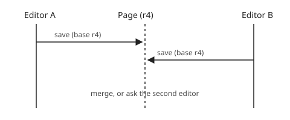

An **edit conflict** happens when two people save changes to the same page
based on the same earlier revision.[^1] See [[Revision History]] for the
general model and [[#Merging|how merging works]] below.

> [!NOTE]
> Most engines merge non-overlapping changes automatically. Only overlapping
> changes need a person to decide.

## Merging

When both edits touch different parts of the page, the engine applies a
three-way merge against the common base revision. The resolution screen shows
both versions side by side. ^conflict-ui

## Terminology

The glossary defines the key term:

![[Glossary#^optimistic-concurrency]]

## Related

- [[Glossary]]
- [[wikipedia:Edit conflict]]
- `[[Edit Conflicts|this page]]` is how a labelled link is written in source.

[^1]: The base revision is the one the editor loaded before starting to type.
